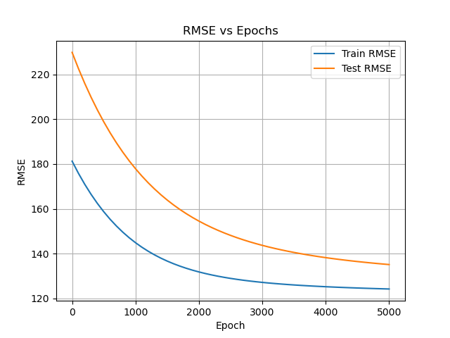

# Part B
## Overview
Part B applies the matrix system from Part A to build a linear regression model for predicting computer performance from hardware features.

We implement:

- Data parsing & normalization from `machine.data`

- Gradient descent to learn weights

- RMSE (root mean square error) evaluation

- Training log in `metrics.csv` for plotting

## `main.cpp`
### Load and Normalize Data
```cpp
std::ifstream file("machine.data");
std::string line;
std::vector<Vector> allFeatures;
std::vector<double> allLabels;

while (getline(file, line)) {
    std::stringstream ss(line);
    std::string token;
    for (int i = 0; i < 2; ++i) getline(ss, token, ','); // skip vendor/model

    Vector x(6);
    for (int i = 0; i < 6; ++i) {
        getline(ss, token, ',');
        x[i] = std::stod(token);
    }

    getline(ss, token, ','); // PRP value
    allFeatures.push_back(x);
    allLabels.push_back(std::stod(token));
}
```
**Explanation**: Reads each line of the dataset, extracts 6 numeric hardware features and the target (PRP), and stores them in vectors.

## Normalize Features
```cpp
std::vector<double> mean(6, 0), stddev(6, 0);

// Compute mean and stddev
for (const auto& row : allFeatures)
    for (int j = 0; j < 6; ++j)
        mean[j] += row[j];
for (int j = 0; j < 6; ++j)
    mean[j] /= allFeatures.size();

for (const auto& row : allFeatures)
    for (int j = 0; j < 6; ++j)
        stddev[j] += std::pow(row[j] - mean[j], 2);
for (int j = 0; j < 6; ++j)
    stddev[j] = std::sqrt(stddev[j] / allFeatures.size());

// Normalize
for (auto& row : allFeatures)
    for (int j = 0; j < 6; ++j)
        row[j] = (row[j] - mean[j]) / stddev[j];
```
**Explanation**: Standardizes features to zero mean and unit variance so gradient descent converges more efficiently.

### Convert to Matrix and Vector
```cpp
int N = allFeatures.size();
int train_size = 160;
Matrix A_train(train_size, 6);
Vector b_train(train_size);
Matrix A_test(N - train_size, 6);
Vector b_test(N - train_size);

for (int i = 0; i < N; ++i) {
    for (int j = 0; j < 6; ++j) {
        if (i < train_size) A_train(i + 1, j + 1) = allFeatures[i][j];
        else A_test(i + 1 - train_size, j + 1) = allFeatures[i][j];
    }
    if (i < train_size) b_train[i] = allLabels[i];
    else b_test[i - train_size] = allLabels[i];
}
```
**Explanation**: Splits data into training and testing sets and stores it in `Matrix` and `Vector` objects.

### Gradient Descent
```cpp
Vector gradientDescent(const Matrix& A, const Vector& b,
                       const Matrix& A_test, const Vector& b_test,
                       int epochs = 5000, double lr = 1e-4)
{
    int n = A.numCols();
    Vector weights(n); // initialize to zero

    std::ofstream logFile("metrics.csv");
    logFile << "epoch,train_rmse,test_rmse\n";

    for (int epoch = 0; epoch <= epochs; ++epoch) {
        Vector prediction = A * weights;
        Vector grad(n);

        for (int j = 0; j < n; ++j) {
            double sum = 0;
            for (int i = 0; i < A.numRows(); ++i)
                sum += (prediction[i] - b[i]) * A(i + 1, j + 1);
            grad[j] = 2.0 * sum / A.numRows();
        }

        for (int j = 0; j < n; ++j)
            weights[j] -= lr * grad[j];

        if (epoch % 100 == 0) {
            double rmse_train = computeRMSE(A, b, weights);
            double rmse_test = computeRMSE(A_test, b_test, weights);
            logFile << epoch << "," << rmse_train << "," << rmse_test << "\n";
        }

        if (epoch % 1000 == 0) {
            std::cout << "Epoch " << epoch
                      << " | Train RMSE: " << computeRMSE(A, b, weights)
                      << " | Test RMSE: " << computeRMSE(A_test, b_test, weights)
                      << std::endl;
        }
    }

    logFile.close();
    return weights;
}
```
**Explanation**: Optimizes weights using gradient descent and logs performance every 100 epochs to a file and prints every 1000 epochs.

### RMSE Function
```cpp
double computeRMSE(const Matrix& A, const Vector& b, const Vector& weights) {
    Vector predictions = A * weights;
    double sum = 0.0;
    for (int i = 0; i < b.size(); ++i)
        sum += std::pow(predictions[i] - b[i], 2);
    return std::sqrt(sum / b.size());
}
```
**Explanation**: Measures how well predictions match the true values. Lower RMSE means better accuracy.

### Visualization (Optional)
You can run this after training:
```python
python plot_metrics.py
```
Which will plot `metrics.csv` using matplotlib.

Here is my RMSE training and test curve over 5000 epochs (`learning_rate = 1e-4`)
